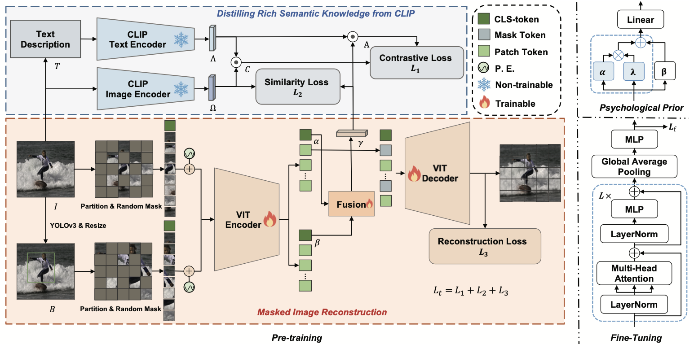

<div align="center">
    
</div>


By [Chuang Chen](https://github.com/chincharles), [Xiao Sun](https://orcid.org/0000-0001-9750-7032)\*, [Zhi Liu](https://orcid.org/0000-0003-0537-4522).

This repo is the official implementation of ["UniEmoX: Cross-modal Semantic-Guided Large-Scale Pretraining for Universal Scene Emotion Perception"](http://arxiv.org/abs/2409.18877).

- Submitted at: IEEE Transactions on Image Processing (TIP)
- Status: In Peer Review.

## 🔆 Updates

***09/02/2024***

Initial commits:

1. Pre-trained models and fine-tuned models for various datasets are provided.
2. Splits for our Emo8 dataset and five other public benchmark datasets are provided.
3. Code for validating performance metrics on diverse datasets is provided.

Please note that the files `<base-path>/models/models_clip.py` and `<base-path>/models/models_mae.py` have not been included in this submission, which means that you cannot use `UniEmoX` pre-training. `<base-path>/models/models_clip.py`、`<base-path>/models/attention_fusion.py` and `<base-path>/models/models_mae.py` will be released upon paper acceptance. You can now use our pre-trained models for fine-tuning and validating our fine-tuned models.

## 🔎 Abstract

Visual emotion analysis holds significant research value in both computer vision and psychology. However, existing methods for visual emotion analysis suffer from limited generalizability due to the ambiguity of emotion perception and the diversity of data scenarios. To tackle this issue, we introduce **UniEmoX**, a cross-modal semantic-guided large-scale pretraining framework. Inspired by psychological research emphasizing the inseparability of the emotional exploration process from the interaction between individuals and their environment, **UniEmoX** integrates scene-centric and person-centric low-level image spatial structural information, aiming to derive more nuanced and discriminative emotional representations. By exploiting the similarity between paired and unpaired image-text samples, **UniEmoX** distills rich semantic knowledge from the CLIP model to enhance emotional embedding representations more effectively. To the best of our knowledge, this is the first large-scale pretraining framework that integrates psychological theories with contemporary contrastive learning and masked image modeling techniques for emotion analysis across diverse scenarios. Additionally, we develop a visual emotional dataset titled Emo8. Emo8 samples cover a range of domains, including cartoon, natural, realistic, science fiction and advertising cover styles, covering nearly all common emotional scenes. Comprehensive experiments conducted on six benchmark datasets across two downstream tasks validate the effectiveness of **UniEmoX**. The source code is available at https://github.com/chincharles/u-emo.

<div align="center">
    
</div>


## ⚙️ Getting Started

### Installation

- Install `CUDA 11.3` with `cuDNN 8` following the official installation guide of [CUDA](https://docs.nvidia.com/cuda/cuda-installation-guide-linux/index.html) and [cuDNN](https://developer.nvidia.com/rdp/cudnn-archive).
- Setup conda environment:

```bash
# Create environment
conda create -n uniemo python=3.8 -y
conda activate uniemox

# Install requirements
conda install pytorch torchvision torchaudio cudatoolkit=11.3 -c pytorch -y

# Clone UniEmoX
git clone https://github.com/chincharles/u-emo.git
cd u-emo

# Install other requirements
pip install -r requirements.txt
```

### Preparing Datasets

To ensure the reproducibility of results, you can use our data splits for training and testing.

|                             UBE                              |                              FI                              |                             Emo8                             |                            CAER-S                            |                             HECO                             |                           Emotion6                           |
| :----------------------------------------------------------: | :----------------------------------------------------------: | :----------------------------------------------------------: | :----------------------------------------------------------: | :----------------------------------------------------------: | :----------------------------------------------------------: |
| [download](https://pan.baidu.com/s/1XCf3yOTEQwJX3G50rwTiIA?pwd=989c) | [download](https://pan.baidu.com/s/1dw01Jd_pKBNotE7AGl8PLA?pwd=7mea) | [download](https://drive.google.com/drive/folders/1bE9FfqQCSo8fKaoy-kOvanwLVMvPMZ8d?usp=sharing) | [download](https://pan.baidu.com/s/11jbAp2cpnM53Xu8w2hkePw?pwd=bzjx) | [download](https://pan.baidu.com/s/19aV6TwnAapiP6_LPXsxR_g?pwd=ru8d) | [download](https://pan.baidu.com/s/1eS1WQiv2Ozx-E4Ef1ibaRA?pwd=8hyr) |

You can also refer to `<root-path>/u-emo/datasets/datasets.py` to reproduce the process of splitting the original data into our dataset.

### Pre-trained Models

The following table provides pre-trained models using `UniEmoX` with 100 and 200 epochs.

| Pre-train Epochs |                      Pre-trained Model                       |
| :--------------: | :----------------------------------------------------------: |
|       100        | [download](https://pan.baidu.com/s/1RRJMZ-WacKeLOLv_kj3G5Q?pwd=q47b) |
|       200        | [download](https://pan.baidu.com/s/1sN97Q5vJ56GOXo6KtpfqSw?pwd=fn62) |

### Pre-training with UniEmoX

To pre-train models with `UniEmoX`, run:

```bash
CUDA_VISIBLE_DEVICES=<gpus-to-use> python -m torch.distributed.launch --nproc_per_node <num-of-gpus-to-use> main_pretrain.py \ 
--data_path <emoset-path> --output_dir <output-directory>
```

Please note that the parameters `data_path` and `output_dir` must be provided according to your location. You can also adjust other parameters in `main_pretrain.py` according to your needs.

### Fine-tuned Models

The following table provides models fine-tuned for 100 epochs on our proposed Emo8 dataset and five other benchmark datasets using pre-trained models.

|                             UBE                              |                              FI                              |                             Emo8                             |                            CAER-S                            |                             HECO                             |                           Emotion6                           |
| :----------------------------------------------------------: | :----------------------------------------------------------: | :----------------------------------------------------------: | :----------------------------------------------------------: | :----------------------------------------------------------: | :----------------------------------------------------------: |
| [download](https://pan.baidu.com/s/1S3vy7UHEMv_8UEbdIiL6qQ?pwd=bfa8) | [download](https://pan.baidu.com/s/142gnWOVzHGC_kQufIQBR4A?pwd=t4i6) | [download](https://pan.baidu.com/s/17xDnqDsWHByAodUe0WWqTQ?pwd=dywi) | [download](https://pan.baidu.com/s/1V3uUvYlM2PAqwPcHK4w0bA?pwd=mx7r) | [download](https://pan.baidu.com/s/1ZGmD_g3BUiiSLm5jYaQjJQ?pwd=wvge) | [download](https://pan.baidu.com/s/13CONfmdytokTJd9S5UFNOw?pwd=t7yz) |

### Fine-tuning pre-trained models
To fine-tune models pre-trained by `UniEmoX`, run:
```bash
CUDA_VISIBLE_DEVICES=<gpus-to-use> python -m torch.distributed.launch --nproc_per_node <num-of-gpus-to-use> main_finetune.py \ 
--finetune <pretrained-ckpt> --data_path <datasets-base-path> --output_dir <output-directory> --dataset <dataset-to-use>
```

Please note that the parameters `finetune`, `data_path`, `output_dir` and `dataset` must be provided according to your location. You can also adjust other parameters in `main_finetune.py` according to your needs.

### Evaluating fine-tuned models

To evaluate the fine-tuned models on our proposed Emo8 dataset and five other public benchmark datasets, run: 

```bash
CUDA_VISIBLE_DEVICES=<gpus-to-use> python -m torch.distributed.launch --nproc_per_node <num-of-gpus-to-use> main_finetune.py \
--eval --resume <fine-tuned checkpoint> --data-path <datasets-base-path> --dataset <dataset-to-use>
```

Please note that the parameters `eval`, `resume`, `data-path` and `dataset` must be provided according to your location. You can also adjust other parameters in `main_finetune.py` according to your needs.


## ❤️ Acknowledgements

This repo is based on [MAE](https://github.com/facebookresearch/mae) and [CLIP](https://github.com/openai/CLIP).

## 📧 Contact Information

For help or issues using `UniEmoX`, please submit a GitHub issue.

For other communications, please contact Chuang Chen (`eric.chuangchen@gmail.com`).

## 🎓Citing UniEmoX

If you use our code or dataset, please cite our paper.

```latex
@article{UniEmoX2024,
  title={UniEmoX: Cross-modal Semantic-Guided Large-Scale Pretraining for Universal Scene Emotion Perception}, 
  author={Chuang Chen and Xiao Sun and Zhi Liu},
  journal={arXiv preprint arXiv:2409.18877},
  year={2024}
}
```

## 📚 License

This code is distributed under an [MIT LICENSE](). Note that our code depends on other libraries and datasets which each have their own respective licenses that must also be followed.
